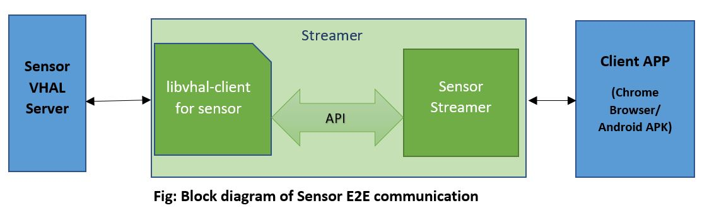
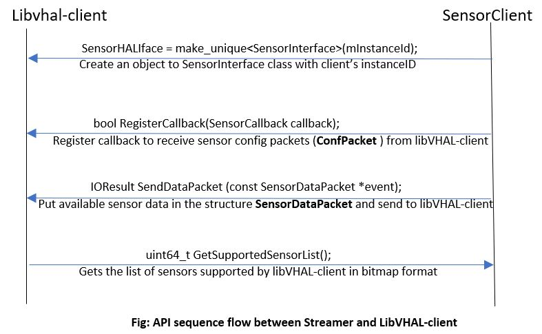

# VHAL Client library 

libvhal-client is a library written in C++17 for Camera, Audio and Sensor modules. Currently only Camera is
supported. Using this library, a client can interact with Camera Vhal without worrying about socket connection,
data structure, command details. Instead, the library exposes simple and powerful API that simplifies the life of
VHAL client modules such as CG-Proxy, Streamer, etc. Any internal changes in the Camera VHAL and the library
is abstracted and hence it won’t affect client code. New features or improvements can be provided via APIs
rather than new socket commands, and other details.

## Build steps

```
shakthi@mypc build (master) mkdir build
shakthi@mypc build (master) cd build
shakthi@mypc build (master) $ cmake ..

-- The CXX compiler identification is GNU 7.5.0
-- Check for working CXX compiler: /usr/bin/c++
-- Check for working CXX compiler: /usr/bin/c++ -- works
-- Detecting CXX compiler ABI info
-- Detecting CXX compiler ABI info - done
-- Detecting CXX compile features
-- Detecting CXX compile features - done
-- Project name: vhal-client
-- Looking for C++ include pthread.h
-- Looking for C++ include pthread.h - found
-- Looking for pthread_create
-- Looking for pthread_create - not found
-- Looking for pthread_create in pthreads
-- Looking for pthread_create in pthreads - not found
-- Looking for pthread_create in pthread
-- Looking for pthread_create in pthread - found
-- Found Threads: TRUE
-- Configuring done
-- Generating done
-- Build files have been written to: /home/shakthi/gitlab/libvhal-client/build

shakthi@Lenovo-Yoga-C740-14IML build (master) $ cmake --build .

Scanning dependencies of target vhal-client
[ 14%] Building CXX object source/CMakeFiles/vhal-client.dir/unix_stream_socket_client.cc.o
[ 28%] Building CXX object source/CMakeFiles/vhal-client.dir/vhal_video_sink.cc.o
[ 42%] Linking CXX shared library ../../libs/linux/libvhal-client.so
[ 42%] Built target vhal-client
Scanning dependencies of target camera_socket_client
[ 57%] Building CXX object examples/CMakeFiles/camera_socket_client.dir/camera_socket_client.cc.o
[ 71%] Linking CXX executable ../../bins/linux/camera_socket_client
[ 71%] Built target camera_socket_client
Scanning dependencies of target camera_client
[ 85%] Building CXX object examples/CMakeFiles/camera_client.dir/camera_client.cc.o
[100%] Linking CXX executable ../../bins/linux/camera_client
[100%] Built target camera_client
```
```
### To install/copy libvhal-clinet.so in to destination directory
cmake -DCMAKE_INSTALL_PREFIX=<Absolute path to install>
      -DCMAKE_INSTALL_LIBDIR=<Relative directory name to install libs>
      -DCMAKE_INSTALL_BINDIR=<Relative directory name to install bins> ..

Example:
libvhal-client$mkdir build
libvhal-client$cd build
cmake -DCMAKE_INSTALL_PREFIX=$(pwd)/..
      -DCMAKE_INSTALL_LIBDIR=lib ..
libvhal-client$make
libvhal-client$make install
```

## Camera

Camera VHal runs socket server (UNIX, VSock are supported). VHAL Client library shall connect to socket server path or address/port endpoint.

### Architecture


### Steps to interact with libVHAL-Client from Streamer

1. Create an object to libVHAL's `vhal::client::VideoSink` by passing `vhal::client::UnixConnectionInfo`.
Then libVHAL will prepare and connect to Camera server using UNIX domain sockets.
```cpp
    UnixConnectionInfo conn_info = { socket_path, instance_id };
    try {
        video_sink = make_shared<VideoSink>(conn_info);
    }
```

2. Register a callback with `vhal::client::VideoSink` for Camera open/close commands.
```cpp
video_sink->RegisterCallback([&](const VideoSink::CtrlMessage& ctrl_msg) {
// Callback Implementation here
}
```

3. Send the camera frames to libVHAL-client as below.
```cpp
video_sink->SendDataPacket(inbuf.data(), inbuf_size);
```

4. For non-encoded data camera frames always of fixed size example I420
   in such cases both vhal and libVHAL-client knows the data size exchange
   in such scenario SendRawPacket will used as below.
```cpp
video_sink->SendRawPacket(inbuf.data(), inbuf_size);
```

Example implementation to interact with libVHAL-client is present in examples/camera_client.cc

## Audio
TODO

## Sensor
Sensor VHAL runs socket server for UNIX and INET domains. VHAL Client library(libvhal-client.so) shall connect to socket server path.

### Architecture
Here shown the E2E block diagram of sensors and API sequence to communicate with libVHAL Client





### Steps to interact with libVHAL-Client from Streamer

1. Create an object to libVHAL's SensorInterface class by passing vhal::client::UnixConnectionInfo.
Then libVHAL will prepare and connect to Sensor server using UNIX domain sockets.
```cpp
    UnixConnectionInfo conn_info = { socket_path, instance_id };
    try {
        sensorHALIface = make_unique<SensorInterface>(conn_info);
    }
```

2. Register a callback func to get sensor control packets upon received from Sensor VHAL server. CtrlPacket contains respective sensor's enable/disable info and sampling period.
```cpp
    sensorHALIface->RegisterCallback([&](const SensorInterface::CtrlPacket& ctrlPkt){});
```

3. Use below api to know list of sensors supported by libVHAL-client or AIC. This API returns supported sensor list in bitmap format.
```cpp
uint64_t GetSupportedSensorList();
```

4. Fill the available sensor data into structure sensorDataPacket. Send the data to libVHAL-client like below
```cpp
sensorHALIface->SendDataPacket(&event);
```

Example implementation to interact with libVHAL-client is present in examples/sensor_client.cc


