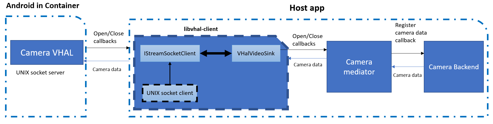

# VHAL Client library (written in C++17) for Audio/Camera/Sensor.

## Build steps

```
shakthi@mypc build (master) mkdir build
shakthi@mypc build (master) cd build
shakthi@mypc build (master) $ cmake ..

-- The CXX compiler identification is GNU 7.5.0
-- Check for working CXX compiler: /usr/bin/c++
-- Check for working CXX compiler: /usr/bin/c++ -- works
-- Detecting CXX compiler ABI info
-- Detecting CXX compiler ABI info - done
-- Detecting CXX compile features
-- Detecting CXX compile features - done
-- Project name: vhal-client
-- Looking for C++ include pthread.h
-- Looking for C++ include pthread.h - found
-- Looking for pthread_create
-- Looking for pthread_create - not found
-- Looking for pthread_create in pthreads
-- Looking for pthread_create in pthreads - not found
-- Looking for pthread_create in pthread
-- Looking for pthread_create in pthread - found
-- Found Threads: TRUE
-- Configuring done
-- Generating done
-- Build files have been written to: /home/shakthi/gitlab/libvhal-client/build

shakthi@Lenovo-Yoga-C740-14IML build (master) $ cmake --build .

Scanning dependencies of target vhal-client
[ 14%] Building CXX object source/CMakeFiles/vhal-client.dir/unix_stream_socket_client.cc.o
[ 28%] Building CXX object source/CMakeFiles/vhal-client.dir/vhal_video_sink.cc.o
[ 42%] Linking CXX shared library ../../libs/linux/libvhal-client.so
[ 42%] Built target vhal-client
Scanning dependencies of target camera_socket_client
[ 57%] Building CXX object examples/CMakeFiles/camera_socket_client.dir/camera_socket_client.cc.o
[ 71%] Linking CXX executable ../../bins/linux/camera_socket_client
[ 71%] Built target camera_socket_client
Scanning dependencies of target camera_client
[ 85%] Building CXX object examples/CMakeFiles/camera_client.dir/camera_client.cc.o
[100%] Linking CXX executable ../../bins/linux/camera_client
[100%] Built target camera_client
```

## Architecture


## Camera

Camera VHal runs UNIX/VSOCK socket server. VHAL Client should connect to socket server path or address/port endpoint.
Camera VHal client might do following steps.

Create a socket client (say, UNIX):
```cpp
auto unix_sock_client = make_unique<UnixStreamSocketClient>(move(socket_path));
```

Handover socket client to `VHalVideoSink` that talks to Camera VHal.
```cpp
VHalVideoSink vhal_video_sink(move(unix_sock_client));
```

Register with `VHalVideoSink` for Camera open/close callbacks as below:
```cpp
vhal_video_sink.RegisterCallback(
      [&](const VHalVideoSink::CtrlMessage& ctrl_msg) {
          switch (ctrl_msg.cmd) {
              case VHalVideoSink::Command::kOpen:
              auto video_params = ctrl_msg.video_params;
              auto codec_type   = video_params.codec_type;
              auto frame_res    = video_params.resolution;

              // Make sure to interpret codec type and frame resolution and
              // provide video input that match these params.
              // For ex: Currently supported codec type is `VHalVideoSink::VideoCodecType::kH264`.
              // If codec type is kH264, then make sure to input only h264 packets.
              // And if frame resolution is k480p, make sure to have the same resolution.

              // Start backend camera source that will provide camera data.
              break;
              
              case VHalVideoSink::Command::kClose:
              // Stop backend camera source.
              break;
          }
});
```

## Audio
TODO

## Sensor
TODO