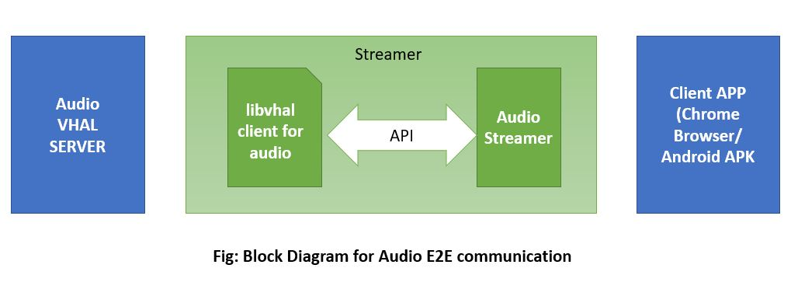

# VHAL Client library 

libvhal-client is a library written in C++17 for Touch, Joystick, GPS, Camera, Audio and Sensor modules. Currently only Camera is
supported. Using this library, a client can interact with Camera Vhal without worrying about socket connection,
data structure, command details. Instead, the library exposes simple and powerful API that simplifies the life of
VHAL client modules such as CG-Proxy, Streamer, etc. Any internal changes in the Camera VHAL and the library
is abstracted and hence it won’t affect client code. New features or improvements can be provided via APIs
rather than new socket commands, and other details.

## Build steps

```
shakthi@mypc build (master) mkdir build
shakthi@mypc build (master) cd build
shakthi@mypc build (master) $ cmake ..

-- The CXX compiler identification is GNU 7.5.0
-- Check for working CXX compiler: /usr/bin/c++
-- Check for working CXX compiler: /usr/bin/c++ -- works
-- Detecting CXX compiler ABI info
-- Detecting CXX compiler ABI info - done
-- Detecting CXX compile features
-- Detecting CXX compile features - done
-- Project name: vhal-client
-- Looking for C++ include pthread.h
-- Looking for C++ include pthread.h - found
-- Looking for pthread_create
-- Looking for pthread_create - not found
-- Looking for pthread_create in pthreads
-- Looking for pthread_create in pthreads - not found
-- Looking for pthread_create in pthread
-- Looking for pthread_create in pthread - found
-- Found Threads: TRUE
-- Configuring done
-- Generating done
-- Build files have been written to: /home/shakthi/gitlab/libvhal-client/build

shakthi@Lenovo-Yoga-C740-14IML build (master) $ cmake --build .

Scanning dependencies of target vhal-client
[ 14%] Building CXX object source/CMakeFiles/vhal-client.dir/unix_stream_socket_client.cc.o
[ 28%] Building CXX object source/CMakeFiles/vhal-client.dir/vhal_video_sink.cc.o
[ 42%] Linking CXX shared library ../../libs/linux/libvhal-client.so
[ 42%] Built target vhal-client
Scanning dependencies of target camera_socket_client
[ 57%] Building CXX object examples/CMakeFiles/camera_socket_client.dir/camera_socket_client.cc.o
[ 71%] Linking CXX executable ../../bins/linux/camera_socket_client
[ 71%] Built target camera_socket_client
Scanning dependencies of target camera_client
[ 85%] Building CXX object examples/CMakeFiles/camera_client.dir/camera_client.cc.o
[100%] Linking CXX executable ../../bins/linux/camera_client
[100%] Built target camera_client
```
```
### To install/copy libvhal-clinet.so in to destination directory
cmake -DCMAKE_INSTALL_PREFIX=<Absolute path to install>
      -DCMAKE_INSTALL_LIBDIR=<Relative directory name to install libs>
      -DCMAKE_INSTALL_BINDIR=<Relative directory name to install bins> ..

Example:
libvhal-client$mkdir build
libvhal-client$cd build
cmake -DCMAKE_INSTALL_PREFIX=$(pwd)/..
      -DCMAKE_INSTALL_LIBDIR=lib ..
libvhal-client$make
libvhal-client$make install
```
## Touch & Joystick
input-pipe\<x\>-\<y\> are used for touch and joystick. The touch supports fingers number from 1 to 10. The finger id should start from 0 in every session. Sample code is here:
```
examples/VirtualInputReceiverSample.cpp
```
### Input Sequence diagram & Pipe data structure Protocol


### Touch Coordinate conversion
1. On a normal mobile phone tablet, the touch size corresponds to the screen size one by one. For example, the screen is X * Y = 1024 * 600, and the touch size is also x * y = 1024 * 600.
2. When initially implementing Remote Input, the screen size X * Y = 720 * 1280 required at the time. We selected the touch size x * y = 720 * 1280. One feature that was planned to be done at that time was to dynamically set the screen size according to the surfaceFlinger display.
3. Touch size may not be consistent with display size Just do the appropriate mapping. The accuracy has changed slightly. For example, Touch is currently x * y = 720 * 1280. The display size is X * Y = 1024 * 600. Given Client X 'and Y', the touch input should be x '= X' * (720-1) / (1024-1). y '= Y' * (1280 -1) / (600-1). 720-1 and 1024-1 are because the maximum value of the abscissa is 719 and 1023. The ordinate is similar.
4. Because the size of the client is variable, the latest solution does not use the dynamic setting of the screen size of the surfaceFlinger display. But in order to preserve the accuracy as much as possible, set the Touch x * y = 32768 * 32768 (starting from 0, signed 16-bit integer maximum + 1). The latest calculation method is: Given Client X 'and Y', then What should be input to touch is x '= X' * (32768-1) / (1024-1). Y '= Y' * (32768 -1) / (600-1).
5. The screen size X * Y can be converted into a float value including 0 to 1. For example, the screen size X * Y = 720 * 1280, given Client X 'and Y', the conversion formula to [0, 1] is: x01 = X '/ (720 -1), y01 = Y' / (1280 -1). Given x01 'and y01', according to the latest version, what should be input to touch is x '= x01' * (32768-1). Y '= y01' * (32768 -1).
6. Please confirm the version you are using (Touch is x * y = 720 * 1280, or Touch is x * y = 32768 * 32768), screen size, and convert the corresponding value.

### Multiple joysticks
AIC could support multiple joysticks and accept a unified scan code depending on Generic.kl. For controller devices with different types or designed by different vendors, their scan code may be different, so customer needs to map the controller device's scan code to the AIC unified scan code when inject joystick's scan code.

Profile for a generic game controller


EV_KEY events scan code map


EV_ABS events axis code value map


If customer would develop your own client app in Android OS, the Android framework provides APIs for detecting and processing user input from game controllers, you could use these APIs to get the Android keycode. Though different joystick vendors' device may have different scan code, Android OS has masked the difference and you could get a unified Android keycode from the Android API. Then the Android keycode could be used to do the map work for joystick. Client app can inspect the key code by calling getKeyCode() or from key event callbacks such as onKeyDown().


## GPS
Socket is used for GPS. Sample code is here:
```
examples/VirtualGpsReceiverSample.cpp
```
### GPS Sequence diagram & Socket data structure Protocol


### GPS - NMEA sentence information
Currently, it only supports Global Positioning System Fix Data(GPGGA).

Reference: http://aprs.gids.nl/nmea/#gga
## Camera

Camera VHal runs socket server (UNIX, VSock are supported). VHAL Client library shall connect to socket server path or address/port endpoint.

### Architecture


### Steps to interact with libVHAL-Client from Streamer

1. Create an object to libVHAL's `vhal::client::VideoSink` by passing `vhal::client::UnixConnectionInfo`.
Then libVHAL will prepare and connect to Camera server using UNIX domain sockets.
```cpp
    UnixConnectionInfo conn_info = { socket_path, instance_id };
    try {
        video_sink = make_shared<VideoSink>(conn_info);
    }
```

2. Register a callback with `vhal::client::VideoSink` for Camera open/close commands.
```cpp
video_sink->RegisterCallback([&](const VideoSink::CtrlMessage& ctrl_msg) {
// Callback Implementation here
}
```

3. Send the camera frames to libVHAL-client as below.
```cpp
video_sink->SendDataPacket(inbuf.data(), inbuf_size);
```

4. For non-encoded data camera frames always of fixed size example I420
   in such cases both vhal and libVHAL-client knows the data size exchange
   in such scenario SendRawPacket will used as below.
```cpp
video_sink->SendRawPacket(inbuf.data(), inbuf_size);
```

Example implementation to interact with libVHAL-client is present in examples/camera_client.cc

## Audio
Audio VHAL runs socket server for INET domains. VHAL Client library(libvhal-client.so) shall connect to socket server path.

### Architecture
Here shown the E2E block diagram of audio


### Steps for using libvhal-client for Audio Recording usecase
1. Create an object to libVHAL's `vhal::client::AudioSink` by passing `vhal::client::TcpConnectionInfo`.
Then libVHAL will prepare and connect to Audio server using TCP domain sockets.
```cpp
    TcpConnectionInfo conn_info = { ip_addr };
    AudioSink audio_sink(conn_info);
```

2. Register a callback with `vhal::client::AudioSink` for Audio open/close commands.
```cpp
audio_sink->RegisterCallback([&](const AudioSink::CtrlMessage& ctrl_msg) {
// Callback Implementation here
}
```

3. Send the raw pcm audio data to libVHAL-client as below.
```cpp
audio_sink->SendDataPacket(inbuf.data(), inbuf_size);
```

Example implementation to interact with libVHAL-client is present in examples/audio_record_client.cc

## Sensor
Sensor VHAL runs socket server for UNIX and INET domains. VHAL Client library(libvhal-client.so) shall connect to socket server path.

### Architecture
Here shown the E2E block diagram of sensors and API sequence to communicate with libVHAL Client


### Steps to interact with libVHAL-Client from Streamer

1. Create an object to libVHAL's SensorInterface class by passing vhal::client::UnixConnectionInfo.
Then libVHAL will prepare and connect to Sensor server using UNIX domain sockets.
```cpp
    UnixConnectionInfo conn_info = { socket_path, instance_id };
    try {
        sensorHALIface = make_unique<SensorInterface>(conn_info);
    }
```

2. Register a callback func to get sensor control packets upon received from Sensor VHAL server. CtrlPacket contains respective sensor's enable/disable info and sampling period.
```cpp
    sensorHALIface->RegisterCallback([&](const SensorInterface::CtrlPacket& ctrlPkt){});
```

3. Use below api to know list of sensors supported by libVHAL-client or AIC. This API returns supported sensor list in bitmap format.
```cpp
uint64_t GetSupportedSensorList();
```

4. Fill the available sensor data into structure sensorDataPacket. Send the data to libVHAL-client like below
```cpp
sensorHALIface->SendDataPacket(&event);
```

Example implementation to interact with libVHAL-client is present in examples/sensor_client.cc


